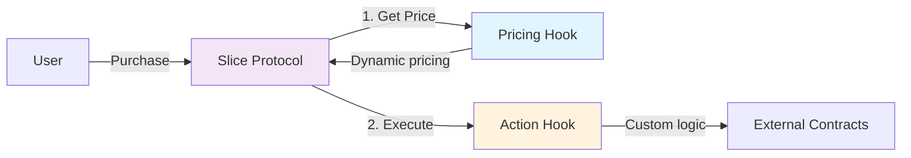

 bv# ▼ Slice Hooks

Smart contracts for custom pricing and actions on [Slice](https://slice.so) products.

## Overview



Hooks enable:
- **Dynamic pricing** - VRGDA, tiered discounts, NFT-based pricing
- **Purchase actions** - Minting, rewards, gating, external integrations

## Architecture

```
┌──────────────────────────────────────┐
│           Hook Types                 │
├──────────────┬───────────────────────┤
│   Registry   │   Product-Specific    │
│  (Reusable)  │    (One-off)          │
├──────────────┼───────────────────────┤
│ ✓ Frontend   │ ✗ Frontend            │
│   integration│   integration         │
│ ✓ Multi-     │ ✓ Custom logic        │
│   product    │ ✓ Simpler setup       │
└──────────────┴───────────────────────┘
```

## Quick Start

### Registry Hooks (Reusable)
Deploy once, use everywhere. Auto-integrated with Slice frontend.

📁 **[Actions](./src/hooks/actions/)** - Gating, minting, rewards  
📁 **[Pricing](./src/hooks/pricing/)** - VRGDA, discounts  
📁 **[Combined](./src/hooks/pricingActions/)** - Price + action  

### Product-Specific Hooks
Custom implementations for individual products.

📁 **[Examples](./src/examples/)** - Reference implementations

## Purchase Flow

```
     ┌────────────┐
     │  Checkout  │
     └─────┬──────┘
           │
     ┌─────▼──────┐
     │ Get Price  │◄── IProductPrice
     └─────┬──────┘
           │
     ┌─────▼──────┐
     │  Purchase  │◄── IProductAction  
     └─────┬──────┘
           │
     ┌─────▼──────┐
     │  Complete  │
     └────────────┘
```

## Interfaces

```solidity
interface IProductPrice {
    function productPrice(...) returns (uint256 ethPrice, uint256 currencyPrice);
}

interface IProductAction {
    function isPurchaseAllowed(...) returns (bool);
    function onProductPurchase(...) external payable;
}
```

## Development

```bash
forge soldeer install  # Install dependencies
forge test            # Run tests
./script/deploy.sh    # Deploy contracts
```

Requires [Foundry](https://book.getfoundry.sh/getting-started/installation).

## Contributing

1. Choose hook type (registry vs product-specific)
2. Inherit appropriate base contract
3. Write tests using base test contracts
4. Submit PR with documentation